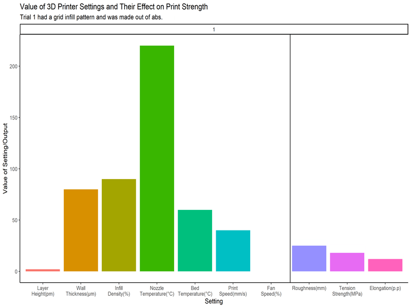

```{r setup, include=FALSE}
knitr::opts_chunk$set(echo = FALSE)

# Learn more about creating websites with Distill at:
# https://rstudio.github.io/distill/website.html

# Learn more about publishing to GitHub Pages at:
# https://rstudio.github.io/distill/publish_website.html#github-pages

library(tidyverse)
library(dplyr)
library(knitr)
library(rmarkdown)
library(plotly)
library(bsselectR)
```

This is essentially an animation of the data and how every setting can create a change in the final product's strength.
Columns to the right of the line are properties of the print while columns to the left are the settings that constructed the print.

```{r gif}

```

```{r pull_and_save}
plots <- c(`Layer Height and Roughness` = "images/layer1.png",
           `Layer Height and Tension Strength` = "images/layer2.png",
           `Layer Height and Elongation` = "images/layer3.png",
           `Wall Thickness and Roughness` = "images/wall1.png",
           `Wall Thickness and Tension Strength` = "images/wall2.png",
           `Wall Thickness and Elongation` = "images/wall3.png")
```

Each factor has its own unique effect on the strength and quality of the 3D print.

```{r}
bsselect(plots, type = "img", show_tick = TRUE)
```

